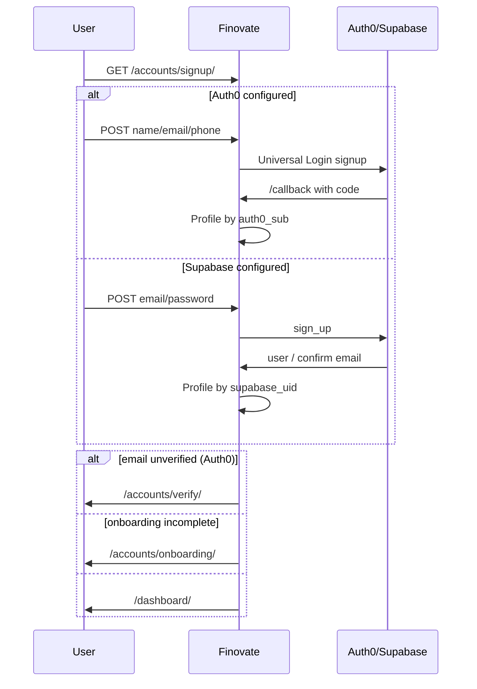

# Registration and email verification

```mermaid
sequenceDiagram
  participant U as User
  participant F as Finovate
  participant A as Auth0/Supabase
  U->>F: GET /accounts/signup/
  alt Auth0 configured
    U->>F: POST name/email/phone
    F->>A: Universal Login signup
    A->>F: /callback with code
    F->>F: Profile by auth0_sub
  else Supabase configured
    U->>F: POST email/password
    F->>A: sign_up
    A->>F: user / confirm email
    F->>F: Profile by supabase_uid
  end
  alt email unverified (Auth0)
    F->>U: /accounts/verify/
  else onboarding incomplete
    F->>U: /accounts/onboarding/
  else
    F->>U: /dashboard/
  end
```

### Failure paths

- Rate limit signup 10 / 10 min per IP
- Auth0 API errors → authentication failed messaging
- Weak Supabase password → form error
